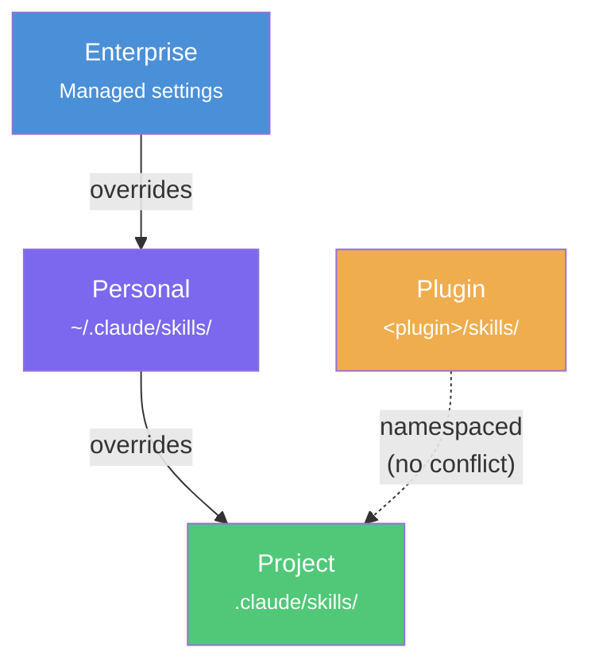
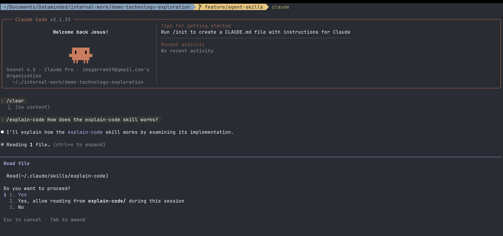
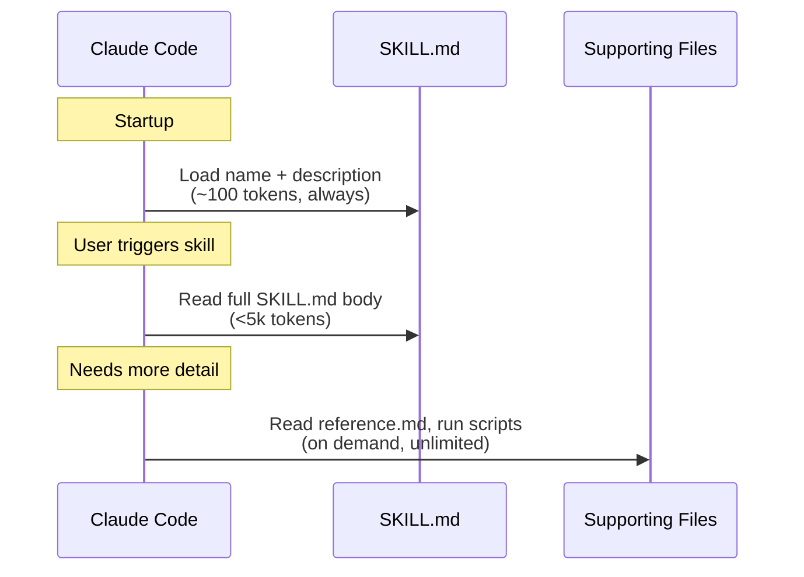

# Creating Agent Skills for Claude Code

**What you'll learn:**

- How to create custom skills (slash commands) that extend Claude Code.
- The difference between project-level and personal-level skills.

## Video
📺 [Watch the demo](<YouTube link>)

## Author
- Name: [Jesus Garcia](https://github.com/jesgarram)

## Stack
- Languages/Frameworks/Tools: Claude Code CLI
- Cloud/Services: local
- Estimated run time: <5 min

## Prereqs
- [Claude Code](https://code.claude.com/docs/en/overview) installed and authenticated

## What are skills?

Skills are directories with a `SKILL.md` file that teach Claude new capabilities. Claude discovers them automatically and uses them when relevant, or you can invoke them directly as `/slash-commands`.

Each `SKILL.md` has two parts: YAML frontmatter (metadata) and a markdown body (instructions):

```yaml
---
name: my-skill
description: What this skill does and when to use it
---

Instructions for Claude go here...
```

Where you store a skill determines its scope. Higher-priority locations win when skills share the same name:



| Level    | Path                                     | Scope               |
|:---------|:-----------------------------------------|:---------------------|
| Personal | `~/.claude/skills/<name>/SKILL.md`       | All your projects    |
| Project  | `.claude/skills/<name>/SKILL.md`         | This project only    |

Project skills get committed to version control — the whole team shares them. Personal skills live in your home directory and work across all projects.

## Setup Steps

### Step 1: Clone the repo

```bash
git clone https://github.com/datamindedbe/demo-technology-exploration
cd demos/agent_skills
```

### Step 2: Install the project-level skill

Copy the example PR review skill into a project's `.claude/skills/` directory:

```bash
mkdir -p .claude/skills/review-pr
cp examples/project-skill/review-pr/SKILL.md .claude/skills/review-pr/SKILL.md
```

This skill reviews a GitHub pull request by number. It uses several interesting frontmatter options:

- **`disable-model-invocation: true`** — Only you can trigger it (Claude won't auto-invoke).
- **`context: fork`** — Runs in an isolated subagent so it doesn't pollute your conversation.
- **`allowed-tools`** — Scoped to read-only tools plus `gh` CLI for safety.
- **`argument-hint: [pr-number]`** — Shows what to pass during autocomplete.
- Uses `` !`command` `` syntax to inject live PR data before Claude sees the prompt.

### Step 3: Install the personal-level skill

Copy the example explain-code skill to your personal skills directory:

```bash
mkdir -p ~/.claude/skills/explain-code
cp examples/personal-skill/explain-code/SKILL.md ~/.claude/skills/explain-code/SKILL.md
```

This skill teaches Claude to explain code with analogies and ASCII diagrams. It uses minimal frontmatter — just `name` and `description` — so Claude can auto-invoke it whenever you ask "how does this work?"

### Step 4: Test the skills

Open Claude Code and type `/explain-code` to invoke the explain-code skill:



Try the PR review skill:

```
/review-pr 42
```

Or ask something that triggers the explain-code skill automatically:

```
How does the authentication flow work?
```

You can also invoke it directly:

```
/explain-code src/main.py
```

## Key concepts

### Frontmatter fields

All fields are optional. Only `description` is recommended.

| Field                      | Description                                                                          |
|:---------------------------|:-------------------------------------------------------------------------------------|
| `name`                     | Display name and `/slash-command`. Defaults to directory name.                        |
| `description`              | What the skill does and when to use it. Claude uses this to decide when to apply it. |
| `argument-hint`            | Hint shown during autocomplete (e.g. `[issue-number]`).                              |
| `disable-model-invocation` | Set `true` so only you can invoke it manually.                                       |
| `user-invocable`           | Set `false` to hide from `/` menu (background knowledge only).                       |
| `allowed-tools`            | Tools Claude can use without asking permission when this skill is active.            |
| `context`                  | Set to `fork` to run in an isolated subagent.                                        |
| `agent`                    | Subagent type when `context: fork` is set (`Explore`, `Plan`, etc.).                 |

### Dynamic substitutions

Use `$ARGUMENTS` in the skill body to insert whatever the user passes. For positional args, use `$0`, `$1`, etc.

Example: if the body says `Fix issue $ARGUMENTS` and you run `/fix-issue 123`, Claude receives `Fix issue 123`.

### Progressive disclosure

Skills load in stages to keep the context window lean:



1. **Metadata** (~100 tokens) — `name` + `description` from frontmatter. Always loaded.
2. **Instructions** (<5k tokens) — The `SKILL.md` body. Loaded when triggered.
3. **Resources** (unlimited) — Supporting files. Loaded or executed on demand.

Keep `SKILL.md` under 500 lines. Move detailed docs to supporting files and reference them from SKILL.md.

## Resources
- [Claude Code Skills documentation](https://code.claude.com/docs/en/skills)
- [Agent Skills overview](https://platform.claude.com/docs/en/agents-and-tools/agent-skills/overview)
- [Agent Skills best practices](https://platform.claude.com/docs/en/agents-and-tools/agent-skills/best-practices)
- [Agent Skills open standard](https://agentskills.io)
