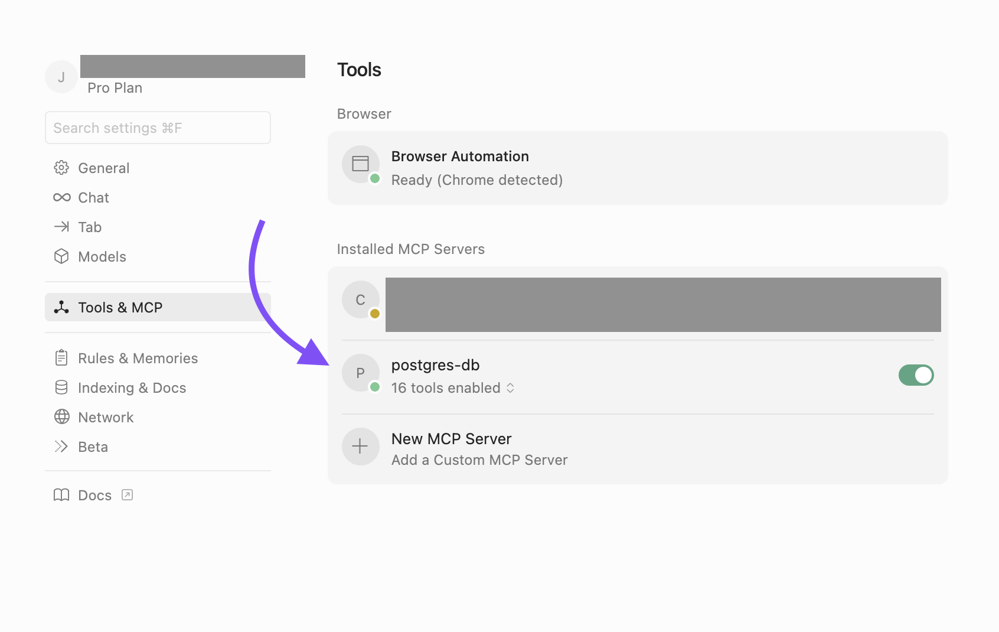

# Using a Postgres MCP Server to Accelerate dbt Development

**What you’ll learn:** 

- How to query your postgres database using natural language.
- How MCPs can become even more powerful in combination with dbt code.

## Video
📺 [Watch the video!](https://youtu.be/tbrR21I3jJI?si=XiG-5bDtC6WJVZSh&utm_source=github&utm_medium=referral&utm_campaign=github_video&utm_content=readme_link)

## Author
- Name: [Emil Krause](https://github.com/emil-k)

## Stack
- Languages/Frameworks/Tools: fastmcp, postgres, dbt
- Cloud/Services: local
- Estimated run time: <5 min

## Prereqs
- [uv](https://github.com/astral-sh/uv)
- [Docker](https://www.docker.com/) and Docker Compose

## Setup Steps

### Step 1: Start PostgreSQL Server

Start the PostgreSQL database and pgAdmin:

```bash
cd demos/postgres_mcp
docker-compose up -d
```

This will start:
- **PostgreSQL** on `localhost:5432`
  - Database: `employee_db`
  - Username: `user`
  - Password: `pass`
- **pgAdmin** on `http://localhost:5050`
  - Email: `admin@admin.com`
  - Password: `root`

### Step 2: Setup the MCP Server in Cursor

First, set up the MCP server environment:

```bash
cd demos/postgres_mcp/mcp_demo
make setup
```

You can run `make status` to check the status of the project. It should output something like this:
```
Working directory: /Users/.../demo-technology-exploration/demos/postgres_mcp/mcp_demo
Python version: Python 3.11.9
uv version: uv 0.6.13 (a0f5c7250 2025-04-07)
Virtual environment: ✅ venv exists
Dependencies: ✅ requirements.txt exists
Server file: ✅ server.py exists
```

Create a config file with the settings for the MCP server. 

On Mac, the path is:
```
/Users/yourusername/.cursor/mcp.json
```

With this structure (replace `<path_to_folder>` with the absolute path to `demos/postgres_mcp/mcp_demo`):

```json
{
  "mcpServers": {
    "postgres-db": {
      "command": "<path_to_folder>/.venv/bin/python",
      "args": [
        "<path_to_folder>/server.py"
      ],
      "env": {
        "DB_HOST": "localhost",
        "DB_PORT": "5432",
        "DB_NAME": "employee_db",
        "DB_USER": "user",
        "DB_PASSWORD": "pass",
        "PYTHONUNBUFFERED": "1"
      }
    }
  }
}
```

If you go to Cursor Settings, the "Tools & MCP" sections should look like this:


### Step 3: Run dbt deps, seed, and run

Set up and run the dbt project:

```bash
cd demos/postgres_mcp/dbt_demo
make setup      # Install DBT and dependencies
make deps       # Install DBT packages
make seed       # Load seed data into the database
make run        # Run all DBT models
```

This will:
1. Install dbt and required packages
2. Install dbt packages (dbt_utils, dbt_date, dbt_expectations)
3. Load the seed CSV files into the database
4. Build all dbt models (staging → intermediate → marts)

### Step 4: Add pgAdmin Connection Manually

1. Access pgAdmin at `http://localhost:5050` and log in with:
   - Email: `admin@admin.com`
   - Password: `root`

2. Right-click on "Servers" (in the left panel) → "Register" → "Server"

3. In the "General" tab:
   - Name: `PostgreSQL Server` (or any name you prefer)

4. In the "Connection" tab:
   - Host name/address: `postgres` (use the Docker service name, not localhost)
   - Port: `5432`
   - Maintenance database: `employee_db`
   - Username: `user`
   - Password: `pass`
   - Check "Save password"

5. Click "Save"

**Note**: Use `postgres` as the hostname (not `localhost`) because pgAdmin runs in a Docker container and needs to connect to the PostgreSQL container via Docker networking.

### Step 5: Test the MCP Server

Use the MCP server to query the database and compare with dbt models. Try asking:

> "Get the department_analytics data from the database and compare to the dbt model. Add data tests to the salary range column"

Depending on the model used, this will:
- Query the `employees_marts.department_analytics` table using the MCP server to retrieve actual data
- Compare the `salary_range` column values with the dbt model calculation (`round((max_salary - min_salary), 2)`) to verify they match
- Create a schema.yml file in `dbt/models/marts/` with data tests for the `salary_range` column:
  - `not_null` test to ensure no null values
  - `dbt_expectations.expect_column_values_to_be_between` test to validate the range is between 0 and 1,000,000
  - `dbt_utils.expression_is_true` test to verify the column matches the expected calculation
- Run the tests using `dbt test --select department_analytics` to validate data quality

## Cleanup

To stop the containers:
```bash
cd demos/postgres_mcp
docker-compose down
```

To stop and remove all data:
```bash
docker-compose down -v
```

## Resources
- [fastmcp](https://github.com/jlowin/fastmcp)
- Docker compose file based on [this post](https://medium.com/@jewelski/quickly-set-up-a-local-postgres-database-using-docker-5098052a4726)
