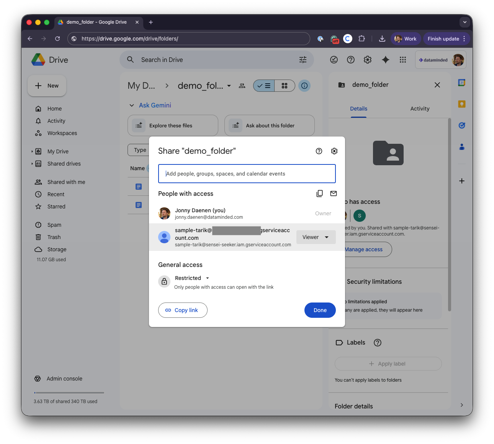

# Building a knowledge Agent with PyAirbyte and MindsDB

**What you’ll learn:** 

- How to ingest data from Google Drive into Postgres using PyAirbyte.
- How to build a knowledge agent with MindsDB.

## Video
📺 [Watch the video - Part 1: PyAirbyte)!](https://www.youtube.com/watch?v=eLUQrSqP-ns&utm_source=github&utm_medium=referral&utm_campaign=github_video&utm_content=readme_link)

📺 [Watch the video - Part 2: MindsDB)!](https://www.youtube.com/watch?v=tfoXvifM-wg&utm_source=github&utm_medium=referral&utm_campaign=github_video&utm_content=readme_link)
## Author
- Name: [Tarik Jamoulle](https://github.com/tarikjamoulle)

## Stack
- python 3.9+
- pyairbyte
- mindsdb
- Docker

## Prereqs
- [Docker](https://www.docker.com/) and Docker Compose
- Google Service Account (to access Google Drive)
- Slack bot token (to access Slack messages)
- OpenAI API key (to create embeddings)


## Setup Steps

I built this to show how you can take documents from Google Drive (or Slack) and make them actually searchable with AI. The kind of "ask questions in plain English" search that actually works.

This repo covers two main things:

**Part 1: Getting the data in** - Using PyAirbyte to pull stuff from Google Drive into Postgres. 

**Part 2: Adding the AI layer** - Using MindsDB to create embeddings and build a chatbot that can answer questions about your documents.

You can run each part separately (great for the video series format) or string them together for the full pipeline.

## How it flows

```
Part 1: Data Ingestion
  Your Google Drive → PyAirbyte → PostgreSQL (with the actual text extracted)

Part 2: AI Layer  
  PostgreSQL → MindsDB → OpenAI embeddings → GPT-4 agent → Ask questions, get answers
```

## What you'll need

**For both parts:**
- Docker & Docker Compose
- Python 3.9+ (for running the demo scripts)

**Part 1 (PyAirbyte) requires:**
- Google Drive service account JSON (to sync Drive files)
- OR Slack bot token (to sync Slack messages)

**Part 2 (MindsDB) requires:**
- OpenAI API key (for embeddings and GPT-4)
- Data already loaded in PostgreSQL (from Part 1)

## Part 1: PyAirbyte - Getting Data In

This is the "boring" part (in a good way) - just moving data from Point A to Point B. No AI, no fancy stuff, just solid ETL.

### Google Drive Setup

Make sure you make a Service Account in the Google Cloud Console and download the JSON key.
then drop it in the secrets/drive_creds/service_account.json file.

Also make sure the service account has access to a Google Drive folder:

The url of the folder will be needed in the next step.

### Setup

```bash
# Clone it
git clone https://github.com/datamindedbe/demo-technology-exploration.git
cd demos/pyairbyte_mindsb

# Copy the env template
cp env.example .env

# Add your Google Drive creds
# 1. Drop your service account JSON in: secrets/drive_creds/service_account.json
# 2. Add your Drive folder URL to .env: GOOGLE_DRIVE_FOLDER_URL=https://...
```


### Run it

```bash
make airbyte
```

That's it. It'll:
- Fire up Postgres (with PGVector already installed)
- Connect to your Google Drive folder
- Pull down all the files and extract text from them (works with PowerPoints, PDFs, docs, etc.)
- Load everything into a `google_drive_files` table
- Leave Postgres running so you can poke around

Want to see what landed in the database?

```bash
docker exec -it playground-knowledge-inventory-postgres psql -U postgres

SELECT name, modified_time FROM google_drive_files LIMIT 10;
```


## Part 2: MindsDB - Making It Smart

Now for the fun part. We take all that data sitting in Postgres and add AI on top of it.

### Setup

```bash
# First, make sure Part 1 is done (you have data in Postgres)

# Add your OpenAI key to .env
echo "OPENAI_API_KEY=sk-your-actual-key" >> .env
```

### Run it

```bash
make mindsdb
```

This will:
- Start MindsDB (it connects to the Postgres container from Part 1)
- Create embeddings for all your documents using OpenAI's API
- Set up a knowledge base with semantic search
- Create an AI agent you can ask questions to

Now you can actually query it:

```bash
# Option 1: Use the web UI
open http://localhost:47334

# Option 2: SQL directly (yes, SQL!)
mysql -h 127.0.0.1 -P 47335 -u mindsdb

# Then ask questions like:
SELECT gdrive_transcript_bot('What presentations do we have about data platforms?') AS answer;
```

And it'll give you answers with citations back to the source documents. Pretty neat.

### Why MindsDB instead of building your own RAG pipeline?

Look, you *could* build this yourself. Set up Pinecone or Weaviate, write your embedding pipeline, handle the OpenAI API calls, build the retrieval logic, figure out prompt engineering...

Or you could just use MindsDB and have it all work through SQL commands:
- `CREATE KNOWLEDGE_BASE` → handles embeddings and vector storage
- `CREATE AGENT` → handles the LLM integration and prompts
- Query it → `SELECT agent('your question')`

I went with MindsDB because I wanted to ship something in hours, not weeks. For most use cases, it's plenty powerful enough.


## Running Both Parts Together

If you want the full end-to-end experience:

```bash
# The easy way (just run these in order)
make airbyte   # Part 1: Get the data
make mindsdb   # Part 2: Add AI layer

# Or if you want to see all the docker commands:
docker compose up -d postgres-inv
docker compose run --rm app python demo.py
docker compose up -d mindsdb
docker compose run --rm app python src/setup_mindsdb.py
```

Grab a coffee during the embedding creation step. it takes a few minutes.

## Project Structure

```
src/
├── airbyte_client.py      # Part 1: PyAirbyte sync logic
├── setup_mindsdb.py       # Part 2: MindsDB knowledge base setup
└── setup_slack_kb.py      # Bonus: Slack integration

demo.py                    # Part 1 demo script
database/init.sql          # PostgreSQL schema
mindsdb_queries/           # Example SQL queries for Part 2
docker-compose.yml         # All services defined here
Makefile                   # Convenient commands for both parts
```

## Additional Documentation

- [SLACK_SETUP.md](SLACK_SETUP.md) - How to use Slack instead of Google Drive

## Useful Commands

```bash
# Part 1: PyAirbyte
make airbyte                   # Run Google Drive sync only
docker compose logs postgres-inv   # Check Postgres logs

# Part 2: MindsDB  
make mindsdb                   # Set up MindsDB knowledge base
docker compose logs mindsdb    # Check MindsDB logs
open http://localhost:47334    # Access MindsDB UI

# General
make stop                      # Stop all services
make clean                     # Remove everything (containers, venv, caches)

# Inspect the data
docker exec -it playground-knowledge-inventory-postgres psql -U postgres
```

## Heads up

**This is a demo, not production code.** There's no authentication, secrets are in files, error handling is minimal. Before deploying this for real, you'd need:
- Actual secrets management (Vault, AWS Secrets Manager, whatever)
- Auth on the MindsDB endpoints
- Better error handling (right now it just fails)
- Monitoring and alerts
- A proper sync schedule with incremental updates

But it's good enough for learning.

## Want to Use This?

Go ahead! This repo is meant for learning and demos. Fork it or adapt it. The code itself is pretty straightforward. The tricky part is just understanding how all the pieces connect.


